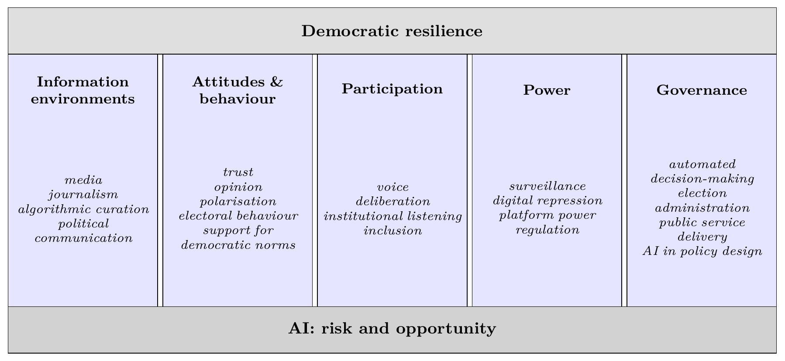
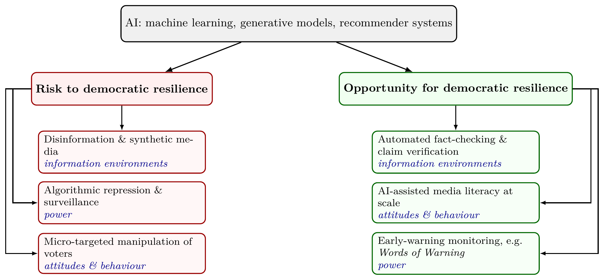
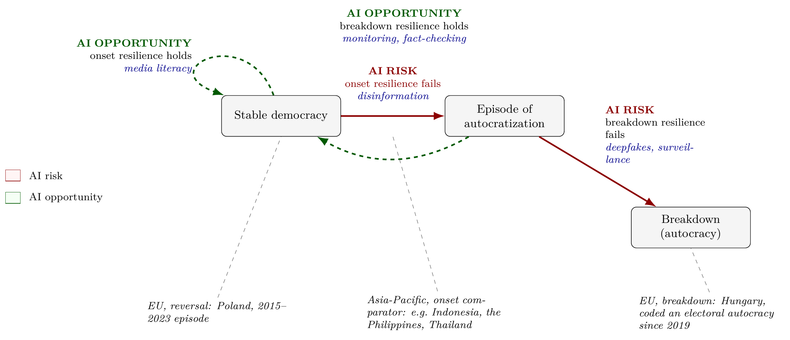
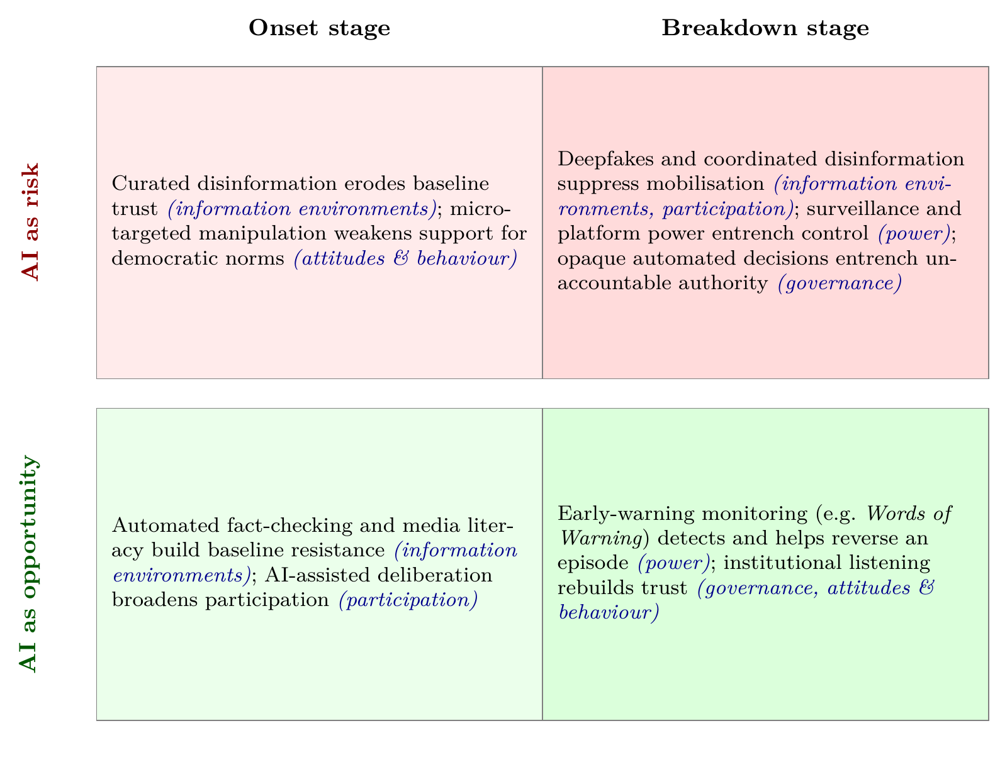

## AI and Democratic Resilience: Risk and Opportunity

### Democratic Resilience

Boese et al.'s two-stage model is simple, tested on V-Dem's global data, and comes from our own team [@boeseetal2021]. Based on this, democratic resilience has two stages:

1. Onset resilience: a democracy avoids sliding into autocratization at all.
2. Breakdown resilience: once sliding has started, a democracy stops it before full breakdown, or reverses it.

For example, Hungary lost onset resilience: V-Dem downgraded it to an electoral autocracy in 2019, the first EU state ever reclassified from democracy [@vdemdr2025]. Poland lost onset resilience in 2015, but kept breakdown resilience: voters reversed the decline at the 2023 election [@lührmannlindberg2019; @vdemdr2025].

Resilience is not just a stock of protective features. It is whether the system's own feedback loops still work. Easton's [-@easton1965] classic model treats a political system as inputs — demands and support from citizens — converted into outputs, fed back into the next round of inputs. A resilient democracy is one where that loop still closes: elections, participation, and responsiveness let citizens correct course before or after a slide starts. We keep "democracy" broad here, not just its liberal variant [@vdemdr2025]. The five pillars, not a fixed threshold, are where that line matters. Information environments carry the input side, governance the output side, and participation and attitudes and behaviour carry the loop back. AI can strengthen or break the loop at any point (Figure 1).

Three recent frameworks group resilience into different arenas. Croissant and Lott [-@croissantlott2025] use institutions, political actors, civil society, and political community, across 103 countries since 2000. Summerfield et al. [-@summerfieldetal2025] use epistemic, material, and foundational impacts. Biddle et al. [-@biddleetal2025], building on the Australian Government's own framework [@homeaffairs2024], use trusted institutions, credible information, and social inclusion, and name AI as a pressure on all three. None of the three treats public administration or the policy process as its own arena. We cover this in our fifth pillar and the proposed Work Package 7 (see below).

Inspired by Gerschewski's [-@gerschewski2013] three pillars of autocratic stability, we reverse the framework, apply it to democracies instead of autocracies, and propose five pillars of democratic resilience. The five pillars are information environments (media, journalism, algorithmic curation, political communication), attitudes and behaviour (trust, opinion, polarisation, electoral behaviour, support for democratic norms), participation (voice, deliberation, institutional listening, inclusion), power (surveillance, digital repression, platform power, regulation), and governance (automated decision-making, election administration, public service delivery, AI in policy design). AI runs under all five, as both risk and opportunity. We score each pillar separately rather than building one aggregate index: a diagnostic needs to show which pillar is under pressure, not just whether resilience overall is up or down. Figure 1 illustrates these pillars.

::: {.content-visible unless-format="docx"}
```{=latex}
\begin{figure}[H]
\centering
\resizebox{0.87\linewidth}{!}{%
\begin{tikzpicture}[
  lbl/.style = {font=\bfseries\small, align=center},
  collbl/.style = {font=\bfseries\footnotesize, align=center, text width=2.7cm},
  sub/.style = {font=\scriptsize\itshape, align=center, text width=2.7cm, execute at begin node={\hyphenpenalty=10000\exhyphenpenalty=10000\relax}}
]
  % roof
  \draw[fill=gray!25] (-7.45,5.4) rectangle (7.45,6.3);
  \node[lbl] at (0,5.85) {Democratic resilience};

  % five columns, edges flush with the roof and base
  \foreach \x/\name/\items in {
    -6.0/{Information\\environments}/{media\\journalism\\algorithmic curation\\political communication},
    -3.0/{Attitudes \&\\behaviour}/{trust\\opinion\\polarisation\\electoral behaviour\\support for democratic norms},
    0/{Participation}/{voice\\deliberation\\institutional listening\\inclusion},
    3.0/{Power}/{surveillance\\digital repression\\platform power\\regulation},
    6.0/{Governance}/{automated decision-making\\election administration\\public service delivery\\AI in policy design}
  }{
    \draw[fill=blue!10] (\x-1.45,0.5) rectangle (\x+1.45,5.4);
    \node[collbl] at (\x,4.7) {\name};
    \node[sub] at (\x,2.4) {\items};
  }

  % base
  \draw[fill=gray!35] (-7.45,-0.4) rectangle (7.45,0.5);
  \node[lbl] at (0,0.05) {AI: risk and opportunity};
\end{tikzpicture}}
\caption{Five pillars of democratic resilience, adapted from Gerschewski's (2013) three pillars of autocratic stability.}
\label{fig:pillars}
\end{figure}
```
:::

::: {.content-visible when-format="docx"}

:::

### AI as Risk and Opportunity

AI here means machine-learning systems, generative models, and recommender systems [@hleg2019; @oecd2019].

Risk:

- Zuboff [-@zuboff2019]: platforms extract data and predict behaviour, reshaping public life.
- Woolley and Howard [-@woolleyhoward2018]: the standard cross-country study of AI-enabled political manipulation.
- Feldstein [-@feldstein2021]: how states use AI for authoritarian control.
- Chesney and Citron [-@chesneycitron2019]: deepfakes as a distinct threat to democracy.
- Bak-Coleman et al. [-@bakcoleman2021]: algorithms shape collective political behaviour.
- Yang, Durotoye and Gil de Zúñiga [-@yangetal2025]: a recent survey of AI's effects on democracy, covering harm and benefit.
- Altman [-@altman2026]: generative AI can turn direct-democracy tools, like referenda, into instability engines.

Opportunity:

- Margetts and Dorobantu [-@margettsdorobantu2019]: AI can make government more responsive and fair, if governed well.
- Noveck [-@noveck2021]: AI-assisted civic participation and public problem-solving. 
- OECD [-@oecd2025civic]: AI-run deliberation platforms can process large citizen input while protecting minority views.
- Fact-checking tools run on the same technology that produces disinformation. This dual use is the point: Work Package 2 (Chapter 2) recruits from both sides of it.

Figure 2 shows this dual nature.

::: {.content-visible unless-format="docx"}
```{=latex}
\begin{figure}[H]
\centering
\begin{tikzpicture}[
  every node/.style = {font=\small},
  root/.style = {draw, rounded corners, fill=gray!12, align=center, minimum width=4.6cm, minimum height=1cm},
  branch/.style = {draw, rounded corners, align=center, minimum width=4.6cm, minimum height=0.9cm, font=\bfseries\small},
  leaf/.style = {draw, rounded corners, align=left, minimum width=4.6cm, text width=4.3cm, minimum height=1.05cm, font=\footnotesize},
  pillar/.style = {font=\scriptsize\itshape},
  >=Latex, thick
]
  \node[root] (ai) at (0,4.1) {AI: machine learning, generative models, recommender systems};

  \node[branch, draw=red!60!black, fill=red!6] (risk) at (-4.6,2.3) {Risk to democratic resilience};
  \node[branch, draw=green!40!black, fill=green!6] (opp) at (4.6,2.3) {Opportunity for democratic resilience};

  \draw[-{Latex[length=2mm]}] (ai) -- (risk);
  \draw[-{Latex[length=2mm]}] (ai) -- (opp);

  \node[leaf, draw=red!60!black, fill=red!3] (r1) at (-4.6,0.55) {Disinformation \& synthetic media\\\pillar{information environments}};
  \node[leaf, draw=red!60!black, fill=red!3] (r2) at (-4.6,-0.85) {Algorithmic repression \& surveillance\\\pillar{power}};
  \node[leaf, draw=red!60!black, fill=red!3] (r3) at (-4.6,-2.25) {Micro-targeted manipulation of voters\\\pillar{attitudes \& behaviour}};

  \node[leaf, draw=green!40!black, fill=green!3] (o1) at (4.6,0.55) {Automated fact-checking \& claim verification\\\pillar{information environments}};
  \node[leaf, draw=green!40!black, fill=green!3] (o2) at (4.6,-0.85) {AI-assisted media literacy at scale\\\pillar{attitudes \& behaviour}};
  \node[leaf, draw=green!40!black, fill=green!3] (o3) at (4.6,-2.25) {Early-warning monitoring, e.g.\ \emph{Words of Warning}\\\pillar{power}};

  \draw[-{Latex[length=1.6mm]}] (risk.south) -- (r1.north);
  \draw[-{Latex[length=1.6mm]}] (risk.west) -- ++(-0.5,0) |- (r2.west);
  \draw[-{Latex[length=1.6mm]}] (risk.west) -- ++(-0.7,0) |- (r3.west);
  \draw[-{Latex[length=1.6mm]}] (opp.south) -- (o1.north);
  \draw[-{Latex[length=1.6mm]}] (opp.east) -- ++(0.5,0) |- (o2.east);
  \draw[-{Latex[length=1.6mm]}] (opp.east) -- ++(0.7,0) |- (o3.east);
\end{tikzpicture}
\caption{AI as risk and opportunity for democratic resilience, by pillar. Same technology, opposite uses.}
\label{fig:ai-dual}
\end{figure}
```
:::

::: {.content-visible when-format="docx"}

:::

### The Bridge: Two Mechanisms

Two recent works cover similar ground but do not make this connection. Jungherr [-@jungherr2023] gives a framework for AI's effects on self-rule, equality, and elections. Wiewiura, Jørgensen and Ploug [-@wiewiuraetal2026] review the wider debate, but stop short of a resilience framework. We connect AI directly to onset/breakdown resilience. As far as we know, no one has done this before (further checks needed).

AI connects to resilience through two mechanisms, each dual-use, together spanning all five pillars:

1. AI-accelerated informationalism (information environments, power, attitudes and behaviour, participation — Easton's input and feedback side): Garbe and Maerz [-@garbemaerz2025; @maerz2026] define authoritarian informationalism as three practices regimes use to hold power: manipulation, surveillance, control. AI adds no fourth practice; it makes these three cheaper and faster. The same capability runs both ways: pattern-detection that targets disinformation can just as easily flag it (Figure 2).
2. AI-accelerated administrative capacity (governance — Easton's output side): a different capability, not manipulation, surveillance, or control, but the speed and accuracy of decisions and services [@margettsdorobantu2019; @georgeklaus2026]. The same automation that speeds up decisions can make them opaque and hard to contest instead (Table 2).

Figure 3 puts informationalism on the resilience diagram: onset and breakdown are regime-level transitions, and informationalism's three practices act directly on them. Administrative capacity works differently — it changes how well the system functions inside a given regime, rather than driving the transition itself — so Figure 4's 2x2 carries it instead, sorted by our five pillars.

::: {.content-visible unless-format="docx"}
```{=latex}
\begin{figure}[H]
\centering
\resizebox{\ifdim\width>\linewidth\linewidth\else\width\fi}{!}{%
\begin{tikzpicture}[
  every node/.style = {font=\small},
  state/.style = {draw, rounded corners, align=center, minimum width=3.2cm, minimum height=1.1cm, fill=gray!8},
  lbl/.style = {font=\footnotesize\itshape, align=left, text width=3.8cm},
  tag/.style = {font=\footnotesize, align=center},
  conn/.style = {gray, dashed, -},
  >=Latex
]
  \node[state] (dem) at (0,5) {Stable democracy};
  \node[state] (epi) at (6,5) {Episode of\\autocratization};
  \node[state] (aut) at (11,2) {Breakdown\\(autocracy)};

  \draw[->, very thick, red!55!black] (dem) -- (epi);
  \node[tag, align=center, text width=3.2cm, red!55!black] at (3,5.85) {\textcolor{red!55!black}{\textbf{AI RISK}}\\onset resilience fails\\\pillar{disinformation}};

  \draw[->, very thick, red!55!black] (epi) -- (aut);
  \node[tag, align=left, text width=2.8cm] at (10.1,4.5) {\textcolor{red!55!black}{\textbf{AI RISK}}\\breakdown resilience fails\\\pillar{deepfakes, surveillance}};

  \draw[->, very thick, green!35!black, dashed] (epi) to[bend left=30] (dem);
  \node[tag, align=center, text width=4.6cm] at (3.3,7.4) {\textcolor{green!35!black}{\textbf{AI OPPORTUNITY}}\\breakdown resilience holds\\\pillar{monitoring, fact-checking}};

  \draw[->, very thick, green!35!black, dashed] (dem) to[out=110,in=160,looseness=4] (dem);
  \node[tag, align=right, text width=3.4cm] at (-4.1,6.6) {\textcolor{green!35!black}{\textbf{AI OPPORTUNITY}}\\onset resilience holds\\\pillar{media literacy}};

  \node[lbl] (lp) at (-1.7,-0.3) {EU, reversal: Poland, 2015--2023 episode};
  \node[lbl] (ls) at (4.2,-0.3) {Asia-Pacific, onset comparator: e.g.\ Indonesia, the Philippines, Thailand};
  \node[lbl] (lh) at (11.5,-0.3) {EU, breakdown: Hungary, coded an electoral autocracy since 2019};

  \draw[conn] (lp.north) -- (dem.south);
  \draw[conn] (ls.north) -- (3,4.45);
  \draw[conn] (lh.north) -- (aut.south);

  \node[draw=red!55!black, fill=red!4, minimum width=0.4cm, minimum height=0.3cm] (legr) at (-7.2,3.4) {};
  \node[right=0.1cm of legr, font=\footnotesize] {AI risk};
  \node[draw=green!35!black, fill=green!4, minimum width=0.4cm, minimum height=0.3cm] (lego) at (-7.2,2.8) {};
  \node[right=0.1cm of lego, font=\footnotesize] {AI opportunity};
\end{tikzpicture}}
\caption{Onset and breakdown resilience (adapted from Boese et al., 2021). Regional cases mapped onto PARADE's two-region design (3.2).}
\label{fig:resilience}
\end{figure}
```
:::

::: {.content-visible when-format="docx"}

:::

::: {.content-visible unless-format="docx"}
```{=latex}
\begin{figure}[H]
\centering
\resizebox{\ifdim\width>\linewidth\linewidth\else\width\fi}{!}{%
\begin{tikzpicture}[
  every node/.style = {font=\small},
  axislabel/.style = {font=\bfseries\small, align=center},
  celltext/.style = {font=\footnotesize, align=left, text width=5.6cm},
  pillar/.style = {font=\scriptsize\itshape},
  rowlabel/.style = {font=\bfseries\small, align=center, rotate=90},
  >=Latex
]
  \fill[red!8]  (0,0) rectangle (6,4.2);
  \fill[red!14] (6,0) rectangle (12,4.2);
  \fill[green!8] (0,-4.6) rectangle (6,-0.4);
  \fill[green!14] (6,-4.6) rectangle (12,-0.4);
  \draw[gray] (0,0) rectangle (12,4.2);
  \draw[gray] (0,-4.6) rectangle (12,-0.4);
  \draw[gray] (6,0) -- (6,4.2);
  \draw[gray] (6,-4.6) -- (6,-0.4);

  \node[axislabel] at (3,4.7) {Onset stage};
  \node[axislabel] at (9,4.7) {Breakdown stage};
  \node[font=\scriptsize, align=center, text width=5.6cm] at (3,-5.1) {};
  \node[font=\scriptsize, align=center, text width=5.6cm] at (9,-5.1) {};

  \node[rowlabel, red!55!black] at (-0.9,2.1) {AI as risk};
  \node[rowlabel, green!35!black] at (-0.9,-2.5) {AI as opportunity};

  \node[celltext] at (3,2.1) {Curated disinformation erodes baseline trust \pillar{(information environments)}; micro-targeted manipulation weakens support for democratic norms \pillar{(attitudes \& behaviour)}};

  \node[celltext] at (9,2.1) {Deepfakes and coordinated disinformation suppress mobilisation \pillar{(information environments, participation)}; surveillance and platform power entrench control \pillar{(power)}; opaque automated decisions entrench unaccountable authority \pillar{(governance)}};

  \node[celltext] at (3,-2.5) {Automated fact-checking and media literacy build baseline resistance \pillar{(information environments)}; AI-assisted deliberation broadens participation \pillar{(participation)}};

  \node[celltext] at (9,-2.5) {Early-warning monitoring (e.g.\ \emph{Words of Warning}) detects and helps reverse an episode \pillar{(power)}; institutional listening rebuilds trust \pillar{(governance, attitudes \& behaviour)}};
\end{tikzpicture}}
\caption{Risk/opportunity by onset/breakdown.}
\label{fig:combined}
\end{figure}
```
:::

::: {.content-visible when-format="docx"}

:::


## Overview of Potential Work Packages

Table 1 sets out working themes for the November/December workshops, mapped to the consortium's team so far. Chapter 4 points to gaps in this regard and includes a list of whom we should contact next to fill those gaps.

::: {.content-visible unless-format="docx"}
```{=latex}
\begin{longtable}{p{0.05\linewidth} p{0.16\linewidth} p{0.32\linewidth} p{0.28\linewidth} r}
\caption{Draft PARADE work packages.}\label{tbl:wp}\\
\toprule
\scriptsize\textbf{WP} & \scriptsize\textbf{Pillar / theme} & \scriptsize\textbf{Core team (confirmed, budgeted)} & \scriptsize\textbf{Deliverables} & \scriptsize\textbf{Budget} \\
\midrule
\endhead
\bottomrule
\endfoot
\scriptsize
WP1 & {\scriptsize Developing the PARADE framework on AI and democratic resilience} & {\scriptsize \textbf{Maerz (UoM)}; Groemping (Griffith); Sanhueza Petrarca (ANU); Gerschewski (WZB); Knutsen (Oslo); Daly (UoM, {\bfseries not yet contacted} --- Democratic Decay \& Renewal)} & {\scriptsize Peer-reviewed framework paper; policy brief series for EU and Australian officials} & {\scriptsize €150{,}000} \\
\addlinespace
WP2 & {\scriptsize Pillar 1: Information environments} & {\scriptsize \textbf{Carson (UoM)}; Hovy (UoM); Benoit (SMU); Leckie (UoM); de Kock (UoM); Baes (UoM); Glazunova (UoM); Saletta (UoM); Trijsburg (UoM); Maerz (UoM); Bailo (Sydney); Notely (WSU)} & {\scriptsize Deployable fact-checking and platform-monitoring toolkit for newsrooms and regulators; peer-reviewed disinformation dataset and paper} & {\scriptsize €700{,}000} \\
\addlinespace
WP3 & {\scriptsize Pillar 2: Attitudes and behaviour} & {\scriptsize \textbf{Groemping (Griffith)}; \textbf{Sanhueza Petrarca (ANU)}; Martinez i Coma (Griffith); Jackman (Uni Canberra); Chernykh (ANU); Biddle (ANU); Nai (ASCoR, online); Australian Electoral Commission ({\bfseries not yet contacted} --- via Daly's ERRN)} & {\scriptsize Public-trust index and policy brief for electoral commissions; survey-experimental paper on AI and political trust} & {\scriptsize €550{,}000} \\
\addlinespace
WP4 & {\scriptsize Pillar 3: Participation} & {\scriptsize \textbf{Kołczyńska (Poland)}; Webb (Uni Canberra, Centre for Deliberative Democracy); Rejón (UoM); Miletic (UoM); Guasti (Czechia); Groemping (Griffith)} & {\scriptsize AI-assisted deliberation pilot with a partner government body; participation-design toolkit; peer-reviewed evaluation paper on the pilot} & {\scriptsize €350{,}000} \\
\addlinespace
WP5 & {\scriptsize Pillar 4: Power --- surveillance and digital repression} & {\scriptsize \textbf{Wilson (Gothenburg)}; Boese (WZB); Knutsen (Oslo); Maerz (UoM); Sanhueza Petrarca (ANU)} & {\scriptsize Early-warning briefing for human-rights and civil-society monitors on digital repression; peer-reviewed paper on AI-enabled digital repression} & {\scriptsize €320{,}000} \\
\addlinespace
WP6 & {\scriptsize Pillar 4: Power --- platform political economy and regulation} & {\scriptsize \textbf{Postnikov (UoM)}; Walter (UoM); Helberger (University of Amsterdam, {\bfseries not yet contacted --- proposed co-lead}); Goldenfein (UoM, {\bfseries not yet contacted} --- platform and data governance); Paterson (UoM, {\bfseries not yet contacted} --- AI governance and regulation)} & {\scriptsize Policy recommendations comparing platform-accountability and AI-specific regulatory models, for DFAT and the European Commission; comparative regulatory-diffusion paper} & {\scriptsize €220{,}000} \\
\addlinespace
WP7 & {\scriptsize Pillar 5: Governance --- public policy and AI literacy in higher education} & {\scriptsize \textbf{Williams (UoM)}; Fu (UoM); Hovy (UoM); Noveck (Northeastern, not yet confirmed --- AI-assisted public problem-solving); Goldenfein (UoM, {\bfseries not yet contacted} --- platform and data governance)} & {\scriptsize AI-literacy training module for public servants; governance guidelines for universities; peer-reviewed paper on AI in research governance} & {\scriptsize €320{,}000} \\
\addlinespace
WP8 & {\scriptsize Methods and tools: quantitative and text infrastructure for the project} & {\scriptsize \textbf{Sebők (ELTE / CEU Democracy Institute)}; Maerz (UoM); Benoit (SMU); Knutsen (Oslo); Boese (WZB); Jackman (Uni Canberra); Kołczyńska (Poland)} & {\scriptsize Open-source text-analysis toolkit and training workshops for partner institutions; methods paper documenting the toolkit} & {\scriptsize €380{,}000} \\
\addlinespace
WP9 & {\scriptsize Two-region synthesis (EU / Asia-Pacific)} & {\scriptsize \textbf{Croissant (Heidelberg)}; Guasti and Farag (Czechia); Webb (Uni Canberra); Strating (La Trobe); Miletic (UoM); Sanhueza Petrarca (ANU); Groemping (Griffith); ISEAS -- Yusof Ishak Institute (Singapore, {\bfseries not yet contacted --- proposed co-lead})} & {\scriptsize Joint EU--Asia-Pacific policy report, briefed to DFAT and the European Commission; peer-reviewed comparative synthesis paper} & {\scriptsize €360{,}000} \\
\addlinespace
WP10 & {\scriptsize Project management, coordination and ethics} & {\scriptsize \textbf{Maerz (UoM)}; Project Manager (TBA); O'Malley (UoM); Major Grants Initiative (UoM)} & {\scriptsize Consortium agreement; periodic reporting; ethics and DMP deliverables} & {\scriptsize €350{,}000} \\
\midrule
\multicolumn{4}{r}{\scriptsize\textbf{Total (estimated)}} & {\scriptsize \textbf{€3{,}700{,}000}} \\
\end{longtable}
```
:::

::: {.content-visible when-format="docx"}
**Table 1: Draft PARADE work packages.**

| WP | Pillar / theme | Core team (confirmed, budgeted) | Deliverables | Budget |
|---|---|---|---|---|
| WP1 | Developing the PARADE framework on AI and democratic resilience | **Maerz (UoM)**; Groemping (Griffith); Sanhueza Petrarca (ANU); Gerschewski (WZB); Knutsen (Oslo); Daly (UoM, **not yet contacted** — Democratic Decay & Renewal) | Peer-reviewed framework paper; policy brief series for EU and Australian officials | €150,000 |
| WP2 | Pillar 1: Information environments | **Carson (UoM)**; Hovy (UoM); Benoit (SMU); Leckie (UoM); de Kock (UoM); Baes (UoM); Glazunova (UoM); Saletta (UoM); Trijsburg (UoM); Maerz (UoM); Bailo (Sydney); Notely (WSU) | Deployable fact-checking and platform-monitoring toolkit for newsrooms and regulators; peer-reviewed disinformation dataset and paper | €700,000 |
| WP3 | Pillar 2: Attitudes and behaviour | **Groemping (Griffith)**; **Sanhueza Petrarca (ANU)**; Martinez i Coma (Griffith); Jackman (Uni Canberra); Chernykh (ANU); Biddle (ANU); Nai (ASCoR, online); Australian Electoral Commission (**not yet contacted** — via Daly's ERRN) | Public-trust index and policy brief for electoral commissions; survey-experimental paper on AI and political trust | €550,000 |
| WP4 | Pillar 3: Participation | **Kołczyńska (Poland)**; Webb (Uni Canberra, Centre for Deliberative Democracy); Rejón (UoM); Miletic (UoM); Guasti (Czechia); Groemping (Griffith) | AI-assisted deliberation pilot with a partner government body; participation-design toolkit; peer-reviewed evaluation paper on the pilot | €350,000 |
| WP5 | Pillar 4: Power — surveillance and digital repression | **Wilson (Gothenburg)**; Boese (WZB); Knutsen (Oslo); Maerz (UoM); Sanhueza Petrarca (ANU) | Early-warning briefing for human-rights and civil-society monitors on digital repression; peer-reviewed paper on AI-enabled digital repression | €320,000 |
| WP6 | Pillar 4: Power — platform political economy and regulation | **Postnikov (UoM)**; Walter (UoM); Helberger (University of Amsterdam, **not yet contacted — proposed co-lead**); Goldenfein (UoM, **not yet contacted** — platform and data governance); Paterson (UoM, **not yet contacted** — AI governance and regulation) | Policy recommendations comparing platform-accountability and AI-specific regulatory models, for DFAT and the European Commission; comparative regulatory-diffusion paper | €220,000 |
| WP7 | Pillar 5: Governance — public policy and AI literacy in higher education | **Williams (UoM)**; Fu (UoM); Hovy (UoM); Noveck (Northeastern, not yet confirmed — AI-assisted public problem-solving); Goldenfein (UoM, **not yet contacted** — platform and data governance) | AI-literacy training module for public servants; governance guidelines for universities; peer-reviewed paper on AI in research governance | €320,000 |
| WP8 | Methods and tools: quantitative and text infrastructure for the project | **Sebők (ELTE / CEU Democracy Institute)**; Maerz (UoM); Benoit (SMU); Knutsen (Oslo); Boese (WZB); Jackman (Uni Canberra); Kołczyńska (Poland) | Open-source text-analysis toolkit and training workshops for partner institutions; methods paper documenting the toolkit | €380,000 |
| WP9 | Two-region synthesis (EU / Asia-Pacific) | **Croissant (Heidelberg)**; Guasti and Farag (Czechia); Webb (Uni Canberra); Strating (La Trobe); Miletic (UoM); Sanhueza Petrarca (ANU); Groemping (Griffith); ISEAS – Yusof Ishak Institute (Singapore, **not yet contacted — proposed co-lead**) | Joint EU–Asia-Pacific policy report, briefed to DFAT and the European Commission; peer-reviewed comparative synthesis paper | €360,000 |
| WP10 | Project management, coordination and ethics | **Maerz (UoM)**; Project Manager (TBA); O'Malley (UoM); Major Grants Initiative (UoM) | Consortium agreement; periodic reporting; ethics and DMP deliverables | €350,000 |
| | | | **Total (estimated)** | **€3,700,000** |
:::

## Relevance of the Project

PARADE targets two Horizon Europe Cluster 2 calls, in this order:

1. Main target: [HORIZON-CL2-2027-02-DEMOCRACY-09](https://ec.europa.eu/info/funding-tenders/opportunities/portal/screen/opportunities/topic-details/HORIZON-CL2-2027-02-DEMOCRACY-09), an open, two-stage call on reinvigorating and shielding European democracy. Total indicative budget €22m, expected EU contribution €2.0–3.7m per project — roughly six to nine projects funded [@ecworkprogramme2027]. Eligibility requires at least one beneficiary with a policy-making role and one civil-society organisation; PARADE does not yet have either (4.1). Opens 2 March 2027, first-stage deadline 4 May 2027.
2. Fallback: [HORIZON-CL2-2027-01-DEMOCRACY-04](https://ec.europa.eu/info/funding-tenders/opportunities/portal/screen/opportunities/topic-details/horizon-cl2-2027-01-democracy-04), a narrower, single-stage call on AI, cyberviolence, and deepfakes. Budget about €3.5–4m per project. Opens 13 May 2027, deadline 23 September 2027.

PARADE is written for the general call. If it does not fit, the same consortium and framework adapt to the narrower one with less rework than starting fresh.

### The Two-Region Design

The two-region design is PARADE's defining feature, and the best answer to: why should an Australian institution lead this, not a European one? A real comparative study of the Asia-Pacific and Europe needs people already working in the Asia-Pacific, existing ties to regional think tanks and survey infrastructure, and closeness to the region's media and policy world. This consortium has all three (3.4).

The two regions test different parts of Figure 4:

- EU cases, mostly breakdown resilience: Several EU states are already inside, or have recently come out of, autocratization episodes: Hungary's long decline; Poland's 2015–2023 episode and its reversal (Figure 3). Risk side: documented AI-generated disinformation and deepfakes in EU states. Opportunity side: EU-based fact-checking and platform-accountability work.
- Asia-Pacific cases (Southeast Asia, Australia, New Zealand), mostly onset resilience: Hybrid and competitive-authoritarian regimes in Southeast Asia [@schedler2013] are the sharper test of whether AI-accelerated informationalism changes the odds that a new episode starts. Opportunity side: Australian fact-checking work, the Centre for Deliberative Democracy's AI-assisted deliberation (Webb, WP4), and Andrea Carson's *Asia-Pacific News Pulse* — a planned annual report on news use, information resilience, and public trust across Indonesia, Thailand, the Philippines, and South Korea, built to close the Asia-Pacific gap in the Reuters Institute Digital News Report. No EU-based team can build this kind of survey infrastructure on this timeline.

::: {.content-visible unless-format="docx"}
```{=latex}
\begin{longtable}{p{0.16\linewidth} p{0.40\linewidth} p{0.40\linewidth}}
\caption{Two-region comparisons, sorted by pillar.}\label{tbl:regional}\\
\toprule
\textbf{Pillar} & \textbf{Risk-side comparison} & \textbf{Opportunity-side comparison} \\
\midrule
\endhead
\bottomrule
\endfoot
Information environments & AI-generated disinformation and deepfakes: Southeast Asia vs.\ EU states & Fact-checking and platform-accountability tools: Australia vs.\ EU newsrooms \\
\addlinespace
Attitudes and behaviour & Micro-targeted manipulation eroding trust and support for democratic norms: Southeast Asian social-media use vs.\ EU electoral campaigns & Media and AI literacy building resistance to manipulation: Australian and EU public-education initiatives \\
\addlinespace
Participation & AI-curated feeds narrowing political attention and civic voice: Southeast Asian platforms vs.\ EU-regulated feeds & AI-assisted deliberation and citizen listening: Australia (Centre for Deliberative Democracy; \emph{Asia-Pacific News Pulse}) vs.\ EU civic-tech pilots \\
\addlinespace
Power (regulation) & Two regulatory frontiers, not one: Australia's platform-accountability model (the world-first 2021 News Media Bargaining Code (Bossio et al., 2022) and the world-first 2025 under-16 social media ban (Weeramanthri, 2026)) vs.\ the EU's AI-specific model (the AI Act, AI Office, and content-moderation rules under the Digital Services Act (2022)) & Evidence on which approach works better: platform accountability or AI-specific rules. Feeds WP6 \\
\addlinespace
Governance & Opaque automated decision-making in migration, welfare, and election administration: Southeast Asian e-government rollouts vs.\ EU public-sector AI deployments & AI-assisted policy design and public-service delivery, tested for fairness and transparency: comparative Australia--EU pilots. Feeds WP7 \\
\end{longtable}
```
:::

::: {.content-visible when-format="docx"}
**Table 2: Two-region comparisons, sorted by pillar.**

| Pillar | Risk-side comparison | Opportunity-side comparison |
|---|---|---|
| Information environments | AI-generated disinformation and deepfakes: Southeast Asia vs. EU states | Fact-checking and platform-accountability tools: Australia vs. EU newsrooms |
| Attitudes and behaviour | Micro-targeted manipulation eroding trust and support for democratic norms: Southeast Asian social-media use vs. EU electoral campaigns | Media and AI literacy building resistance to manipulation: Australian and EU public-education initiatives |
| Participation | AI-curated feeds narrowing political attention and civic voice: Southeast Asian platforms vs. EU-regulated feeds | AI-assisted deliberation and citizen listening: Australia (Centre for Deliberative Democracy; *Asia-Pacific News Pulse*) vs. EU civic-tech pilots |
| Power (regulation) | Two regulatory frontiers, not one: Australia's platform-accountability model (the world-first 2021 News Media Bargaining Code (Bossio et al., 2022) and the world-first 2025 under-16 social media ban (Weeramanthri, 2026)) vs. the EU's AI-specific model (the AI Act, AI Office, and content-moderation rules under the Digital Services Act (2022)) | Evidence on which approach works better: platform accountability or AI-specific rules. Feeds WP6 |
| Governance | Opaque automated decision-making in migration, welfare, and election administration: Southeast Asian e-government rollouts vs. EU public-sector AI deployments | AI-assisted policy design and public-service delivery, tested for fairness and transparency: comparative Australia–EU pilots. Feeds WP7 |
:::

DEMOCRACY-09 asks proposals to build on prior Horizon-funded work without duplicating it [@ecworkprogramme2027]. Most competing teams are EU-only or EU-plus-one (this needs more research). They can only account for one column of Figure 4 - PARADE accounts for both.

### Why It Matters to the EU

Why should the EU fund Asia-Pacific research instead of more EU-only work?

1. It is already an EU priority. The EU Strategy for Cooperation in the Indo-Pacific names digital governance and partnerships as a priority [@euindopacific2021].
2. It tests the EU's own reach. The Brussels Effect [@bradford2020] — the EU's ability to set global standards through its own rules (the AI Act, the Digital Services Act [-@dsa2022]) — only shows up if it travels beyond the EU. PARADE tests that directly.
3. It matters for EU digital diplomacy. Other digital-governance models compete for influence in Southeast Asia. Evidence on how AI pressures and responses play out there feeds directly into the EU's own position.
4. It gives the sharpest test. Onset resilience is easier to test where regime paths actually differ, as they do across Southeast Asia, than by re-running EU cases. Australia and New Zealand add a further comparison inside the same region.

### Why Now

The EU's Democracy Shield and the AI Act timeline make 2026–27 the moment EU funders want this research: the call names AI's impact on democracy, and democratic resilience and civic preparedness, as priorities [@ecworkprogramme2027]. In 2024, about two billion voters across fifty countries went to the polls. V-Dem's latest report finds autocracies now outnumber democracies worldwide for the first time in two decades; the average world citizen's level of democracy is back to 1985 [@vdemdr2025]. Guardrails once thought stable in established democracies are more fragile than assumed [@levitskyziblatt2018]. Whether AI-accelerated informationalism and administrative capacity affect onset or breakdown resilience is squarely inside the call's scope.

### Why Led from Australia

Section 3.2 makes the main case. Five more reasons:

1. First-mover eligibility. Australia joins Horizon Europe Pillar II from January 2027. Australian institutions can lead Cluster 2 consortia on equal terms with EU states for the first time.
2. Real seniority, not borrowed credibility. The Australian lead was Deputy Director of the V-Dem Institute (2020–21) and remains a V-Dem Research Associate. The team includes a V-Dem project PI (Knutsen, Oslo) and the WZB co-authors of both frameworks this proposal builds on [@boeseetal2021; @garbemaerz2025]. The lead's EU policy record is real, not aspirational: a 2025 report for the Robert Schuman Centre and the European Commission on AI-powered threats to democracy [-@maerzetal2025policy], co-authored with team member Chernykh (ANU, WP3) and Sanhueza Petrarca.
3. Genuine independence. The call wants international cooperation and no duplication. An EU-only team cannot show independence. An Australian hub with real Asia-Pacific content can.
4. Access an EU team cannot claim. Bec Strating (La Trobe, WP9) directs La Trobe Asia and leads the DFAT-funded Blue Security network on Indo-Pacific maritime security; that access, plus existing regional research links and the *Asia-Pacific News Pulse* (3.2), give this team a starting point a Berlin- or Gothenburg-led bid would have to build from zero.
5. Value for money. An Australian hub delivers EU-grade science at a different cost base than the EU capitals hosting most competing teams.
6. Two regulatory frontiers, not one. Australia's News Media Bargaining Code (2021) was the world's first platform-payment law for news, later copied by Canada [@bossioetal2022]. Its under-16 social media ban (2025) was the world's first of its kind [@weeramanthri2026]. The EU leads on AI-specific rules instead, through the AI Act and the AI Office. A team based in only one place can draw on only one of these. PARADE draws on both (Table 2).

### Why the University of Melbourne

UoM has what this needs in one place: the Centre for Advancing Journalism (Carson) for disinformation and media-industry ties, plus Carson's *Asia-Pacific News Pulse* (3.2); Melbourne Connect and the School of Computing and Information Systems (Hovy, Leckie, de Kock, Baes) for computational and NLP infrastructure; and Maerz's ARC DECRA project *Words of Warning*, which already uses LLMs to monitor democratic discourse — a working example of the opportunity side of Figure 2. Maerz's V-Dem history and EU policy record mean the Australian lead already has working ties to V-Dem Gothenburg, WZB Berlin, and the European Commission. 

## Filling Gaps in the Consortium

### Gaps

Six gaps stand out.

1. Eligibility. DEMOCRACY-09 requires a public-body beneficiary and a civil-society beneficiary [@ecworkprogramme2027]; the consortium (Table 1) has neither confirmed. Without both, the proposal is inadmissible, not just weaker.
2. Public body. Fastest fix: an Australian electoral commission, via Tom Daly's standing ERRN partnership (below) — also becomes WP3's own audience.
3. Civil society / Southeast Asia institution. Only individual contacts so far, not an institution. ISEAS -- Yusof Ishak Institute (Singapore, below) could fill both roles, leading a work package.
4. WP6. Thin and entirely UoM: no international team member, and no EU AI Act, Digital Services Act, or platform-law expertise, a DEMOCRACY-04 priority [@ecworkprogramme2027]. Helberger, Goldenfein, and Paterson (below) fix this.
5. General AI governance. No one works on AI in public administration. Wagner (below) is the fit.
6. Southeast Asia expertise. No confirmed survey partner matches ANU's ANUpoll (Biddle, WP3), ahead of the *Asia-Pacific News Pulse* going live.

Two smaller gaps: AI-enabled gendered harm (Citron, below) and computer-vision detection for fake video and audio, both DEMOCRACY-04 priorities [@ecworkprogramme2027; @chesneycitron2019].

### Who to Contact Next

Eleven names, high priority only. Medium- and low-priority names are tracked outside this document.

| Name | Institution / Country | Gap addressed |
|---|---|---|
| Aries Arugay | University of the Philippines Diliman; ISEAS – Yusof Ishak Institute | Southeast Asia-based partner, the biggest open gap; his own work on Philippine democratic erosion and resilience maps onto WP9 |
| Lee Sue-Ann | ISEAS – Yusof Ishak Institute | Second Southeast Asia-based option, on AI and political narratives — deepens WP2/WP9 |
| **Natali Helberger** | University of Amsterdam | Platform political economy and regulation; ERC-funded, studies platforms as political actors with real opinion power — **the genuine international co-lead WP6 lacks; female, EU-based** |
| **Jeannie Paterson** | University of Melbourne | AI governance and regulation, in-house; co-founding Director of CAIDE (Centre for AI and Digital Ethics), 2024 member of the Commonwealth AI Advisory Committee — not EU-AI-Act-specific, but the closer topical and practical fit; **complements Postnikov and Walter's platform-law gap in WP6** |
| Danielle Citron | University of Virginia | AI-enabled gendered harm and deepfakes; author of the paper already cited in Chapter 1 [@chesneycitron2019] |
| Beth Noveck | Northeastern University | Civic-tech side of Figure 4 [@noveck2021]; complements Williams and Fu in WP7 |
| **Ben Wagner** | TU Delft | General AI governance, the gap flagged above; directs the AI Futures Lab, works on algorithmic accountability in public decision-making — **a European counterpart to Noveck for WP7** |
| **Tom Daly** | University of Melbourne | Not an AI-civic-tech specialist like Noveck, but the closer in-house match: runs Democratic Decay \& Renewal (DEM-DEC), directly on PARADE's core topic, and directs the Electoral Regulation Research Network (ERRN) — a standing partnership with Australian electoral commissions; **the fastest route to the public-body partner DEMOCRACY-09 requires (4.1), and strengthens WP1/WP3** |
| Isabelle Augenstein | University of Copenhagen | Multimodal, automated fact-checking (ERC-funded) — complements WP2 |
| Andreas Vlachos | University of Cambridge | Automated claim verification (ERC-funded) — complements WP2 |
| Zeerak Talat | University of Edinburgh | NLP fairness/bias and online-harm detection — complements WP2's gendered-harm gap |

Only Arugay and Lee Sue-Ann close the Southeast Asia gap. Recruit one of them first.

## AI Use Statement {.unnumbered}

Claude Code (Sonnet 5), an AI assistant developed by Anthropic, was used as an assistance tool for figure production as well as structuring and editing the text for consistency and language refinement. It was also used to identify and research potential collaborators and gap-filling contacts, summarising their publicly available research profiles from institutional and academic sources online; every such profile was checked against those sources before inclusion, but the choice of whom to approach remained with the authors. All substantive decisions as well as all conceptual, methodological, and interpretive aspects of the manuscript remained with the authors. All AI-generated outputs were carefully reviewed and verified by the authors, who take full responsibility for the final content.

## References {.unnumbered}
