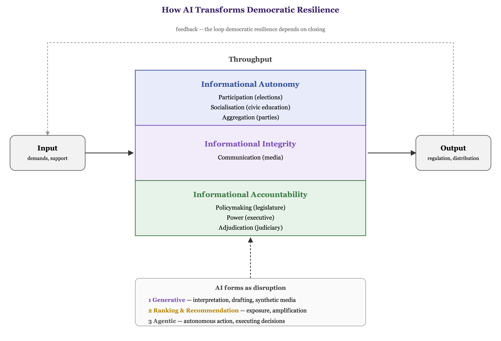
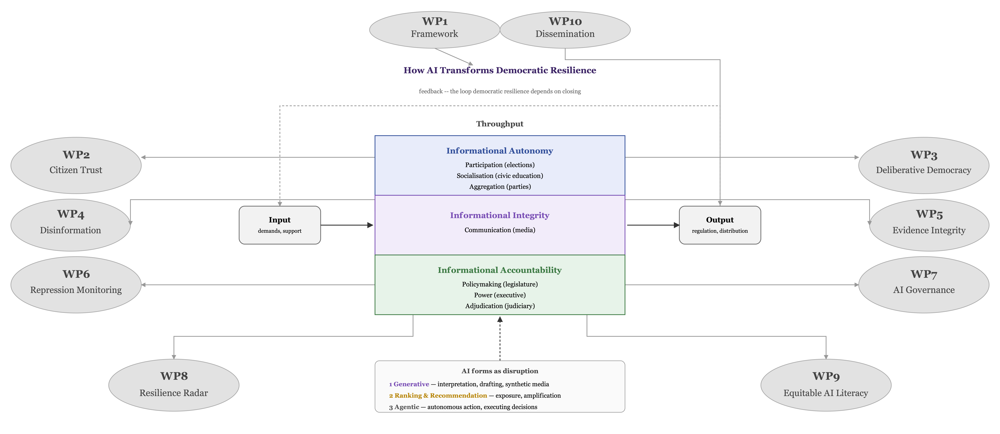

*Keep in mind - important to be eligible for submission!\**

-   *This is a two-stage call with the first stage being a 10-page **blind** submission, meaning no names of researchers, no institutions are named (only in second stage) - of course, we should still have all personnel in place when submitting to the first stage*
-   *We need at least one but ideally more civil society institutions as beneficiary (WP lead) or affiliated partner (Taks lead). I suggest Tactical Tech (or similar) is the main lead of WP9 and we try to get a fact-checking organisation on board for WP4 plus maybe another think tank to partner with us for dissemination (WP10).*
-   *We need to have at least one policy-making institution being involved - not necessarily as beneficiary but as affiliated partner(s). DFAT and a European component...? Any ideas?*
-   *We need to have a midterm assessment of our outcomes in place, with specific democracy practicioners and policy-makers committed to do so when we submit!*
-   *I re-read the other (single-stage) call again on "Addressing the impact of artificial intelligence, cyberviolence, and deepfakes on equality, democracy and inclusive societies" and suggest we only focus on this call if we do not make it to the second stage of the other call as we would need to re-structure our proposal substantially to also cover cyberviolence and it would also need to become much more techy.*

We define democratic resilience as a political system's capacity to sustain or restore its core democratic qualities under pressure [@biddleetal2025; @boeseetal2021; @merkel2026; @croissantlott2025; @luhrmann2021]. We study it as a citizen–information–institution loop [@easton1965]: citizen demands are the input, institutions convert them into decisions through a throughput process, and the resulting output feeds back to citizens as the next round of input. Following the classical distinction between what citizens do, what carries information between citizens and institutions, and what institutions do [@almondpowell1966], we split the loop into three components: informational autonomy, informational integrity, and informational accountability.

Informational autonomy is citizens' capacity to form and act on their own judgments [@dahl1989democracy; @andersonpro2026]. Informational integrity is the accuracy and plurality of the shared evidence base and information ecosystems citizens and institutions draw on [@habermas1962strukturwandel; @dahl1989democracy]. Informational accountability is institutions' exposure to being checked and corrected [@schedler1999conceptualizing; @bovens2007analysing]. Resilience requires all three to work equitably: when only the best-resourced can claim autonomy, integrity, or accountability, that inequality makes democratic backsliding more likely [@lührmannlindberg2019; @merkellührmann2021].

Artificial intelligence disrupts this loop directly, reshaping how citizens form judgments and how institutions are scrutinised [@jungherr2023; @Kreps2023; @Farrell2026; @wiewiuraetal2026]. Three forms carry this disruption: generative AI, which fabricates content; ranking and recommendation systems, which shape what is seen; and agentic AI, which increasingly executes rather than just informs decisions [@Schmid2026]. Each is dual-use: the same capability that erodes a component by default can strengthen it by design [@Noveck2026; @Ovadya2023; @Cavaliere2022; @koenigwenz2022].

Our goal is to diagnose this erosion and build the tools that reverse it. We pilot these tools in the EU and Australia — two consolidated democracies with different regulatory starting points — and extend the diagnosis to Southeast Asia and the Pacific's hybrid and backsliding cases, capturing the fuller range of AI's disruptive power.

{#fig-loop width="7in"}

@fig-loop illustrates how we conceptualize democratic resilience through the lens of informational autonomy, integrity, and accountability, and how different forms of AI disrupt the loop.

## Informational Autonomy — Citizens

*\[Constanza to add\]*

Relevant literature Seraphine identified and tagged in Mendeley: @andersonpro2026; @Croce2025; @konig2023; @Ohren2026; @Ovadya2023.

## Informational Integrity — The Shared Environment

*\[Max to add\]*

Relevant literature Seraphine identified and tagged in Mendeley: @Lundberg2025; @Dan2019; @Bhandari2025; @Kay2024.

## Informational Accountability — Institutions

Democratic accountability is institutions' exposure to being checked and corrected: the separation of legislative, executive, and judicial power, alongside the press and other actors that monitor them [@schultz1998]. Accountability has two parts — an obligation to explain and justify conduct, and the capacity of others to sanction or correct it when that justification fails [@schedler1999conceptualizing; @bovens2007analysing; @Luhrmann2020]. An institution that explains itself without ever facing consequences is not accountable, and neither is one that can be sanctioned but is never required to answer. Both depend on information. Institutions must make their actions and the reasons for them sufficiently visible and well explained for others to critically assess them. These critical assessors must then be able to use that information to question, contest, and, where necessary, correct or sanction the institution. We therefore refer to this as informational accountability: the informational conditions through which institutions become answerable to those with the authority or capacity to check them.

Artificial intelligence can weaken informational accountability by making responsibility for public decisions harder to trace. As public administrations increasingly rely on AI-mediated information and decisions, it can become more difficult to determine who is responsible for a decision, on what information it was based, and how it can be challenged or corrected [@margettsdorobantu2019]. Hence, AI can negatively affect the public sphere and widen power asymmetries between citizens and institutions [@Nasi2025], reshape elections and the institutional mechanisms through which accountability operates [@jungherr2023; @summerfieldetal2025], and more broadly undermine democratic processes [@Kreps2023; @jackson2025realdangers; @altman2026], while also being deployed directly as a tool of authoritarian control [@feldstein2021; @garbemaerz2025]. Apart from that, the capacity to demand accountability is itself unevenly distributed: well-resourced and organised interests can compel institutions to provide information, justify decisions, or correct wrongdoing far more effectively than small civil-society groups. This makes the transparency and contestability of AI-mediated decisions particularly consequential for citizens who have the fewest resources with which to scrutinise them [@jungherr2023].

The same capabilities that can weaken accountability can also be used to strengthen it. This requires designing AI as *democratic AI*: systems developed around democratic requirements such as transparency, traceability, explanation, critical assessmnet, and opportunities for correction, rather than treating these as safeguards to be added after deployment [@Noveck2026; @busuioc2021]. Audit and transparency tools can make AI-mediated decisions traceable, while institutional arrangements can ensure that those decisions and their underlying reasons remain open for critical investigations [@Cavaliere2022; @beckmanetal2024; @wieringa2020]. AI can thus become not only an object of accountability but also an instrument for strengthening it, by reducing some of the informational and analytical costs of oversight and enabling citizens and civil-society organisations to evaluate and challenge public decisions [@Noveck2026; @Cavaliere2022; @koenigwenz2022]. Designed in this way, AI has the potential to narrow rather than widen existing asymmetries in the capacity to hold institutions to account.

## Work Packages

{#fig-wp width="6.5in"}

Rules for WP development: every lead is also a task leader on a different work package, so expertise is not in silos. Second, duality: every work package diagnoses both how AI disrupts its topic as a risk factor and how that same disruption can be redirected as a benefit for citizens and democracy, rather than defaulting to the negative reading alone. Third, outreach: every work package delivers a policy-relevant product built for actual use, typically a public-facing digital tool, dashboard, or toolkit, alongside its academic output. Fourth, equity: WP9 is dedicated to the cross-group equity the call highlights, but every work package's own risk/benefit split is read across social groups, not just in aggregate. Fifth, budget is preliminary for now but will be fairly distributed across WPs/tasks.

### WP1: Framework

**Research question:** How can AI's risks to democratic resilience and its potential to strengthen it be captured in one shared framework, replacing fragmented, ad hoc assessments?

**Lead:** Maerz, Sanhueza Petrarca, Groemping · **Impact:** gives every other WP a common vocabulary and a public-facing tool to score a country's exposure to AI-driven democratic erosion.

-   **Task 1.1: Synthesizing the literature** — Which concepts from political science and AI research does a shared framework need to reconcile? Output: a literature synthesis spanning both fields.

-   **Task 1.2: Building a shared coding scheme** — How should "risk" and "benefit" be operationalized consistently across all other WPs? Output: a shared coding scheme used project-wide.

-   **Task 1.3: Selecting comparative cases** — Which cases in the EU, Australia, and Southeast Asia/Pacific give the fullest range of AI's disruptive power? Output: the project's comparative case selection.

-   **Task 1.4: Building the diagnostic tool** — How can the framework be made usable outside academia? Output: the framework paper, policy briefs, and the Resilience Diagnostic web tool.

**Preliminary budget:** €300,000 (preliminary — total project budget ÷ 10 WPs).

### WP2: Citizen Trust

**Research question:** Does exposure to AI-generated political content erode citizens' trust in democratic institutions, and can calibrated AI transparency tools rebuild it?

**Lead:** Sanhueza Petrarca, Jackman, Kolczynska · **Impact:** gives electoral commissions and civic educators an evidence-based, field-tested way to counter AI-driven trust erosion rather than guessing at it.

-   **Task 2.1: Measuring the erosion** — How much does exposure to AI-generated political content shift citizens' trust in specific institutions? Output: a panel survey measuring trust before and after exposure, feeding the public-trust index.

-   **Task 2.2: Testing what rebuilds it** — Which AI transparency labels actually restore trust rather than just adding noise? Output: a survey experiment comparing labelling designs.

-   **Task 2.3: Making it usable for institutions** — What should an electoral commission actually do with these findings? Output: an electoral-commission brief translating the evidence into practice.

-   **Task 2.4: Tracking it over time** — How does trust move as AI content and countermeasures evolve? Output: a public trust-tracker dashboard.

**Preliminary budget:** €300,000 (preliminary — total project budget ÷ 10 WPs).

### WP3: Deliberative Democracy Pilot

**Research question:** Can a structured AI moderator help citizen assemblies find genuine common ground, or does it just manufacture the appearance of consensus?

**Lead:** Kolczynska, Webb, Hovy, Kashima, Notely · **Impact:** gives practitioners a tested, field-ready alternative to purely human-facilitated deliberation, with evidence on where AI moderation helps and where it fails.

-   **Task 3.1: Designing the platform** — What does an AI moderator need to do differently from a recommendation algorithm to support rather than distort deliberation? Output: the AI-moderated deliberation platform design.

-   **Task 3.2: Running the live pilot** — Does AI moderation change what citizen assemblies actually discuss and agree on? Output: live citizen-assembly pilots run in parallel with human-facilitated sessions.

-   **Task 3.3: Comparing outcomes** — Where does AI-moderated consensus hold up under scrutiny, and where does it just look like agreement? Output: the comparative paper and a participation-design toolkit for practitioners.

**Preliminary budget:** €300,000 (preliminary — total project budget ÷ 10 WPs).

### WP4: Disinformation Monitoring

**Research question:** Can the same generative capability that floods the public sphere with AI-made disinformation be turned into a real-time detection signal for the institutions meant to correct it?

**Lead:** Carson, Glazunova, de Kock, Wilson, fact-checking civil-society organisation · **Impact:** gives regulators and newsrooms a validated, shared detection layer instead of each acting on its own unverified judgment calls.

-   **Task 4.1: Building the pipeline** — What signals reliably distinguish AI-generated disinformation from ordinary misleading content, across countries? Output: the cross-country detection pipeline.

-   **Task 4.2: Validating against real judgments** — Does the pipeline's flagging match what professional fact-checkers actually conclude? Output: validation against partner fact-checkers' assessments, producing the FAIR dataset.

-   **Task 4.3: Getting it into institutional hands** — What do regulators need from a detection signal to act on it? Output: the regulator brief.

-   **Task 4.4: Getting it into newsroom hands** — What do time-pressed newsrooms need from a detection signal to use it daily? Output: the fact-check toolkit for newsrooms.

**Preliminary budget:** €300,000 (preliminary — total project budget ÷ 10 WPs).

### WP5: Evidence Integrity

**Research question:** Can a certification protocol distinguish AI-fabricated evidence from human-verified evidence reliably enough for newsrooms and the public to trust it?

**Lead:** Groemping, O'Brien, Koenig · **Impact:** gives citizens and journalists a shared, checkable standard for what counts as verified evidence in an environment where fabrication is cheap.

-   **Task 5.1: Designing the protocol** — What provenance markers can reliably separate AI-generated from human-verified evidence? Output: the provenance-tagging and certification protocol.

-   **Task 5.2: Testing it with real users** — Does the protocol hold up when newsroom partners actually try to use it under deadline pressure? Output: field-testing with newsroom partners, feeding the paper.

-   **Task 5.3: Making it publicly checkable** — How can anyone, not just partner newsrooms, verify a piece of evidence's certification status? Output: the certification toolkit and public verification API.

**Preliminary budget:** €300,000 (preliminary — total project budget ÷ 10 WPs).

### WP6: Repression Monitoring

**Research question:** Does AI-enabled surveillance and censorship concentrate hardest in states with the weakest oversight, and can tracking that pattern itself become an early-warning signal?

**Lead:** Wilson, Knutsen, Croissant, Sombatpoonsiri, Maerz · **Impact:** gives human-rights monitors a standing, updated signal instead of relying on episodic, after-the-fact reporting.

-   **Task 6.1: Tracking deployment** — Which AI-enabled surveillance and censorship tools are backsliding states actually deploying, and where? Output: expert-coded tracking across cases.

-   **Task 6.2: Automating the signal** — Can automated media monitoring catch deployment as it happens, rather than months later? Output: the automated media-monitoring component.

-   **Task 6.3: Turning tracking into warning** — What pattern in this tracking data actually predicts further backsliding, early enough to act on? Output: the paper and the early-warning dashboard for human-rights monitors.

**Preliminary budget:** €300,000 (preliminary — total project budget ÷ 10 WPs).

### WP7: AI Governance

**Research question:** Do existing AI governance regimes actually require the transparency, audit, and redress that informational accountability depends on, or do they leave institutions free to evade scrutiny?

**Lead:** Koenig · **Impact:** gives policymakers a concrete, comparative basis for closing the gap between what AI governance promises and what it actually enforces.

-   **Task 7.1: Mapping what's on the books** — What do AI governance regimes in the EU, Australia, and Southeast Asia/Pacific formally require of AI-mediated institutional decisions? Output: the regulatory-comparison tracker.

-   **Task 7.2: Testing enforcement** — Which of these formal requirements are actually enforced, and which are checkbox compliance? Output: the comparative paper.

-   **Task 7.3: Identifying what travels** — Which accountability provisions transfer across very different regulatory contexts, and which don't? Output: policy recommendations.

**Preliminary budget:** €300,000 (preliminary — total project budget ÷ 10 WPs).

### WP8: Resilience Radar

**Research question:** Can the separate indicators produced across WP2–WP7 be integrated into one shared panel sensitive enough to flag democratic-resilience shifts as they happen, rather than after the fact?

**Lead:** Sebok, Croissant, Maerz · **Impact:** turns findings that would otherwise sit in separate WP silos into one standing, cross-country monitoring instrument.

-   **Task 8.1: Integrating the indicators** — How compatible are the indicators coming out of WP2–WP7, and what does it take to put them on one common panel? Output: the integrated cross-country panel.

-   **Task 8.2: Building the classifier** — Can an LLM classifier trained on this panel reliably distinguish real resilience shifts from noise? Output: the trained LLM classifier and methods paper.

-   **Task 8.3: Making it public** — How should this signal be presented so outside users can actually act on it? Output: the FAIR toolkit and the Resilience Radar dashboard.

**Preliminary budget:** €300,000 (preliminary — total project budget ÷ 10 WPs).

### WP9: Equitable AI Literacy

**Research question:** Which AI-literacy training formats actually close the gap in underserved communities' capacity to identify and contest AI-mediated content, rather than just reaching those already equipped to cope?

**Lead:** Tactical Tech, Notely, Williams · **Impact:** turns equity from an aggregate afterthought into WP9's direct object, giving underserved communities the same practical capacity to contest AI-mediated decisions that better-resourced groups already have.

-   **Task 9.1: Co-designing with the communities affected** — What do underserved communities themselves identify as the gap in their ability to engage with AI-mediated content? Output: co-designed curriculum content.

-   **Task 9.2: Piloting formats head-to-head** — Which training formats and delivery modes, tested against each other, close the gap fastest? Output: the pilot comparing formats.

-   **Task 9.3: Packaging what works** — How can the format that works best be packaged for reuse beyond the pilot communities? Output: the accessible AI-literacy curriculum and training toolkit.

-   **Task 9.4: Documenting the gap** — How large is the equity gap in AI-mediated participation, and how much does it close? Output: the paper on the equity gap.

**Preliminary budget:** €300,000 (preliminary — total project budget ÷ 10 WPs).

### WP10: Public Engagement & Dissemination

**Research question:** How can the diagnoses and tools produced across WP1–WP9 reach the citizens, policymakers, and civil-society actors who are actually exposed to AI's disruption of democratic resilience?

**Lead:** Maerz, UniMelb Research Office, Tactical Tech · **Impact:** closes the loop between diagnosis and use, so the project's findings change practice rather than sitting in academic outputs alone.

-   **Task 10.1: Building the public-facing tool** — How can nine WPs' worth of technical findings become one usable app for ordinary citizens? Output: the Resilience Companion app launch.

-   **Task 10.2: Reaching policymakers and civil society** — What do policymakers and civil-society partners need from this project to actually act on it? Output: policymaker and civil-society workshops, and the brief compendium.

-   **Task 10.3: Closing out the project** — How is the full body of findings synthesized and reported to funders and partners? Output: the final report.

**Preliminary budget:** €300,000 (preliminary — total project budget ÷ 10 WPs).

## References
