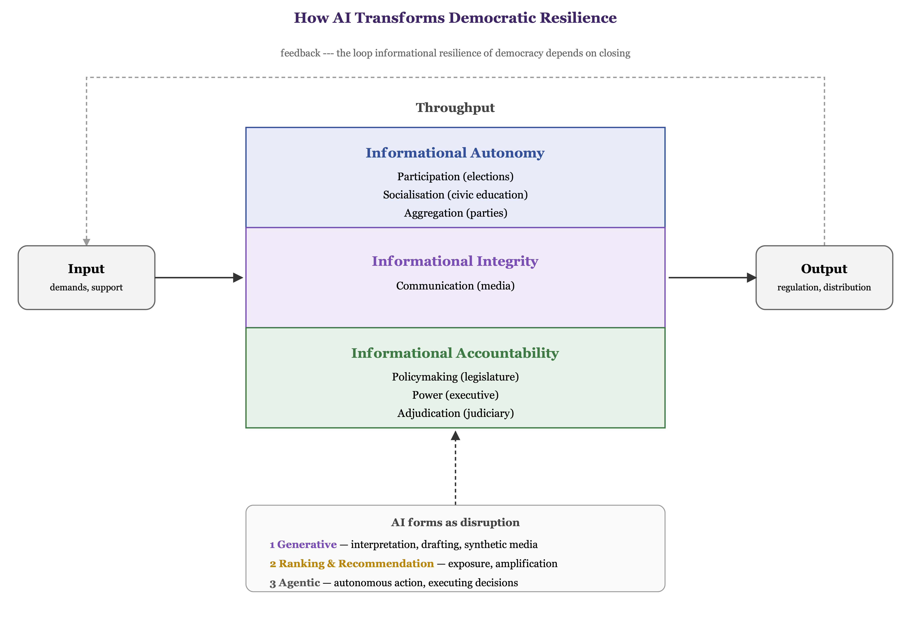
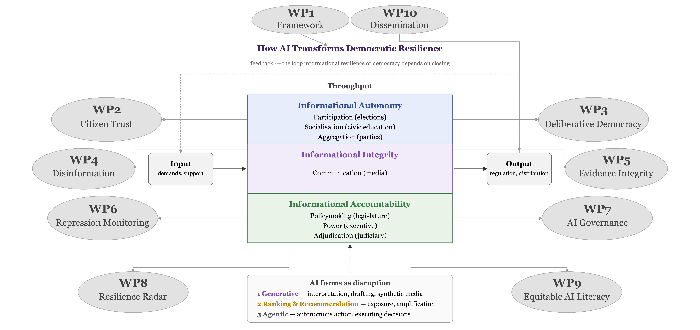

**Please note:** *This document is not yet the proposal itself. It serves to conceptualize the overarching theoretical framework on which we will develop the work packages, before we draft the actual proposal. The Horizon Europe two-stage application process requires a very specific structure for the first stage: the submission is blind (no names of researchers or institutions), strictly limited to 10 pages, and must strictly follow this structure: 1. Excellence — 1.1 Objectives and ambition, 1.2 Methodology; 2. Impact — 2.1 Project's pathways towards impact. This means the framework as well as the WPs and their objectives need to be woven into this structure, which is why we will focus on writing this up only once the framework and work packages are developed sufficiently — that is, after the Dec 9/10 workshop.*

**What we need from you now:** *Please critically assess the theoretical framework for its clarity and pertinence and add any comments or suggestions you might have. We also kindly ask WP leads/co-leads/task leads to look at the proposed outline of their work package/task and add their comments and suggestions, especially also if you have ideas on what civil society organisation or policy-making institution we could still involve — nothing more is needed at this point. During the workshop, the team will split into work-package groups to develop each WP's own objectives, methodology, and pathways to impact in the detail the proposal requires. Thank you, your input is really appreciated!*

# Theoretical framework: informational resilience of democracy

The resilience of democracies worldwide is being tested like never before by mounting internal and external pressures, including inequality, declining trust, governance failures, climate change, and authoritarian aggression, all of which threaten core democratic institutions and practices. The rapid societal uptake of advanced artificial intelligence (AI) since the early 2020s has compounded some of these pressures while introducing new concerns about the risks of "runaway AI."

Scholars have grappled with these twin developments by identifying the institutional and discursive conditions that underpin democratic resilience [@biddleetal2025; @boeseetal2021; @croissantlott2025; @dryzeketal2019; @merkel2026; @ercanetal2025], developing frameworks for understanding AI's effects on democracy [@altman2026; @summerfieldetal2025; @Schroeder2026; @garbemaerz2025; @notleyetal2026], and examining how AI might strengthen democratic governance and popular participation [@Noveck2026; @tessleretal2024; @Margetts2024]. Yet we still lack a systematic account of how AI affects democratic resilience and, consequently, of how policy can maximize its benefits while limiting its risks.

To fill this gap, we propose a new model of informational resilience: it conceptualizes democratic resilience as a property of systems of information feedback, and identifies how AI can undermine or strengthen a system's capacity to sustain or restore its core democratic qualities under pressure. The overarching objective of this project is therefore to diagnose AI-driven erosion of democratic qualities and to develop, test and transfer the tools that counter it. We develop and pilot these tools in the EU and Australia — two consolidated democratic settings with contrasting regulatory environments — and extend the diagnosis to hybrid and backsliding cases in Southeast Asia and the Pacific, where AI's disruptive potential is least constrained. This design yields evidence and instruments that are robust across regulatory regimes rather than specific to one, and directly usable by EU institutions, national decision-makers and civil society organisations.

We define democratic resilience as a political system's capacity to sustain or restore its core democratic qualities under pressure [@biddleetal2025; @boeseetal2021; @croissantlott2025; @luhrmann2021; @merkel2026], which depends on the system's capacity to gather and process information, make decisions, and respond adequately to citizens' needs. For a democracy to be informationally resilient, citizens must have autonomy to gather information, form opinions and act on their own judgments [@andersonpro2026; @dahl1989democracy], information circulating through the system must have integrity [@dahl1989democracy; @habermas1962strukturwandel], and institutions must remain accountable for how that information is turned into regulation and policy [@bovens2007analysing; @schedler1999conceptualizing]. All three are a pre-condition for resilience and must work equitably: when only the best-resourced can claim autonomy, integrity, or accountability, that inequality makes democratic backsliding more likely [@lührmannlindberg2019; @merkellührmann2021].

AI disrupts this information loop directly, reshaping how citizens form judgments and how institutions are scrutinised [@Farrell2026; @jungherr2023; @Kreps2023; @wiewiuraetal2026]. Three forms carry this disruption: generative AI, which fabricates content; ranking and recommendation systems, which shape what is seen; and agentic AI, which increasingly executes rather than just informs decisions [@Schmid2026]. Each is dual-use: the same capability that erodes a component by default can strengthen it by design [@Cavaliere2022; @koenigwenz2022; @Noveck2026; @Ovadya2023].

{#fig-loop width=7in}

@fig-loop illustrates how we conceptualize informational resilience of democracy through the lens of autonomy, integrity, and accountability, and how different forms of AI disrupt the loop.

## Informational autonomy — citizens

Informational autonomy refers to citizens' capacity to gather information, form opinions, and act based on their own judgments [@andersonpro2026; @dahl1989democracy]. Following @andersonpro2026 [p. 3], this informational autonomy has two dimensions: *authenticity*, the freedom to form beliefs, values and preferences that are genuinely one's own, arrived at through reflection rather than manipulation; and *agency*, the ability to act effectively on them in private and public life. Both dimensions are unequally distributed, varying systematically with education, gender, socioeconomic status, language, disability, age and digital access, so any investigation on informational autonomy must ask not only whether the overall capacity is strengthened or eroded, but for whom specifically.

AI poses a risk to informational autonomy: the same systems that help citizens interpret information also help compose what they say, while ranking and recommendation systems shape what they encounter and whether their expressions are able to reach decision-makers, making it harder to tell where a citizen's reasoning ends and the system's contribution begins. This risk is distributional as well. Language models inherit the biases of their training data, over-representing dominant English-speaking, Western and male perspectives, and systems that enforce standard linguistic norms silence or distort minority voices [@Ohren2026, p. 6]. Algorithmic selection carries the same risk under a claim of neutrality: in the Global Assembly, an algorithm excluded participants from Pacific Island states — among those most affected by climate change — on grounds of fairness [@Ohren2026, p. 7]. @andersonpro2026 call this tension the *autonomy paradox*: AI can make participation easier while weakening the independence of judgment, or support reflective judgment while constraining citizens' capacity to act on it.

AI can also strengthen informational autonomy. It can reduce the cost of political learning, compliance and psychological burdens that hamper citizens' access to information and democratic institutions, and can act as a facilitator that summarizes arguments and surfaces paths to compromise within deliberation [@Croce2025, p. 54]. These burdens fall unevenly, and so do the gains from lifting them: the citizens least able to navigate complex administrative and informational systems could benefit most. Evidence shows that conversational agents can widen who speaks as well as how many, improving perceived conversation quality and democratic reciprocity and raising participation among under-represented groups [@Croce2025, p. 55; @Ohren2026, p. 6], and AI-augmented representative deliberation has been proposed as a way to make participatory processes workable at scales previously out of reach [@Ovadya2023, pp. 163, 166; @Noveck2026] — but only where citizens retain control over the agenda, the information and the conclusions [@Ohren2026]. For informational resilience of democracy, then, the key question is not whether citizens use AI, but whether they remain the authors of the demands that enter the political system, and whether all citizens do so on equal terms.

## Informational integrity — the shared environment

Informational integrity is the extent to which the shared evidence base circulating through the democratic feedback loop is accurate, authentic, and pluralistic [@oecd2024factsnotfakes, p. 9]. Democracy requires citizens to understand how political institutions operate and to access evidence relevant to competing policy claims [@lewandowskyetal2023]. In the feedback-loop model, this requirement applies in both directions. On the input side, citizens need reliable information to form preferences, while institutions need information that accurately reflects social conditions and public demands. On the output side, citizens need reliable information about government decisions and performance to evaluate outcomes and revise their preferences. Informational integrity therefore depends on the conditions under which political information is produced, distributed, and amplified [@bennettlivingston2018; @freelonwells2020]. It is degraded when falsehoods, exclusion, or strategic manipulation distort this shared evidence base [@eckeretal2026; @humprechtetal2020].

AI can weaken informational integrity on both sides of the democratic feedback loop. For citizens, generative models can produce persuasive propaganda at low cost [@goldsteinetal2024], while deepfakes increase uncertainty about genuine evidence and reduce trust even without direct deception [@Lundberg2025; @vaccarichadwick2020]. Generative systems may also amplify dominant narratives while marginalizing less represented voices, narrowing the evidence base entering the loop [@Kay2024]. For institutions, fluent but unverifiable outputs create "epistemic boundedness" in administrative judgment, the policymaking equivalent of the citizen autonomy paradox [@kimetal2026].

Conversely, AI can also strengthen informational integrity, specifically by improving access to evidence and the processing of feedback. For example, evidence-based LLM dialogues can correct conspiracy beliefs or misinformation endorsement [@costelloetal2024], and synthesize diverse viewpoints into group statements that participants prefer to human-mediated alternatives, while better incorporating minority positions [@tessleretal2024]. Within government, human-in-the-loop LLM analysis can help officials process large volumes of policy documents and consultation material [@turobovcoyle2026], or systematically analyze citizen input at scales that are difficult to process manually [@bonorosselloetal2025].

## Informational accountability — institutions

Informational accountability concerns the information that circulates back from institutions once they act: institutions must make their decisions and the reasons behind them sufficiently visible and well explained for that information to reach those with the authority or capacity to check them, question, contest, and, where necessary, correct or sanction them. This runs on two components — an obligation to explain and justify decisions and actions, and the capacity of others to sanction or correct them when that justification fails [@bovens2007analysing; @Luhrmann2020; @schedler1999conceptualizing] — which the separation of legislative, executive, and judicial power, and the press and other actors that monitor them, are designed to guarantee [@schultz1998]. An institution that explains itself without ever facing consequences is not accountable, and neither is one that can be sanctioned but is never required to answer.

Artificial intelligence can weaken informational accountability by making responsibility for public decisions harder to trace. As public administrations increasingly rely on AI-mediated information and decisions, it can become more difficult to determine who is responsible for a decision, on what information it was based, and how it can be challenged or corrected [@margettsdorobantu2019]. Hence, AI can negatively affect the public sphere and widen power asymmetries between citizens and institutions [@Nasi2025], reshape elections and the institutional mechanisms through which accountability operates [@jungherr2023; @summerfieldetal2025], and more broadly undermine democratic processes [@altman2026; @jackson2025realdangers; @Kreps2023], while also being deployed directly as a tool of authoritarian control [@feldstein2021; @garbemaerz2025]. Apart from that, the capacity to demand accountability is itself unevenly distributed: well-resourced and organised interests can compel institutions to provide information, justify decisions, or correct wrongdoing far more effectively than small civil-society groups. This makes the transparency and contestability of AI-mediated decisions particularly consequential for citizens who have the fewest resources with which to scrutinise them [@jungherr2023].

The same capabilities that can weaken accountability can also be used to strengthen it. This requires designing AI as *democratic AI*: systems developed around democratic requirements such as transparency, traceability, explanation, critical assessment, and opportunities for correction, rather than treating these as safeguards to be added after deployment [@busuioc2021; @Noveck2026]. Audit and transparency tools can make AI-mediated decisions traceable, while institutional arrangements can ensure that those decisions and their underlying reasons remain open for critical investigations [@beckmanetal2024; @Cavaliere2022; @wieringa2020]. AI can thus become not only an object of accountability but also an instrument for strengthening it, by reducing some of the informational and analytical costs of oversight and enabling citizens and civil-society organisations to evaluate and challenge public decisions [@Cavaliere2022; @koenigwenz2022]. Designed in this way, AI has the potential to narrow rather than widen existing asymmetries in the capacity to hold institutions to account.

# Work packages

{#fig-wp width=7.2in}

Rules for WP development:

1. Symmetry: every work package diagnoses both how AI disrupts its topic as a risk factor and how that same disruption can be redirected as a benefit for citizens and democracy (impact!).
2. Outreach: every work package delivers a policy-relevant product built for actual use, typically a public-facing digital tool, dashboard, or toolkit, alongside its academic output.
3. Equity: WP9 is dedicated to the cross-group equity the call highlights, but every work package's own risk/benefit split is read across social groups, not just in aggregate. Gender is a particular priority.

Budget estimates below assume average fully-loaded EU/Australian institutional rates per FTE-year: Lead €120,000, postdoctoral researcher €75,000, project manager €70,000, and €20,000/year for distribution and dissemination activities. WP1 runs for the first six months only; WP2–WP9 run for two years starting once WP1 concludes; WP10 runs for three years, starting alongside WP1 and continuing six months beyond WP2–WP9's conclusion to complete dissemination, since it also covers overall project management. These are illustrative averages, not institution-specific quotes, and should be replaced with actual rates before submission.

## WP1: Framework

**Research question:** How can AI's risks to democratic resilience and its potential to strengthen it be encompassed in one shared framework, overcoming fragmented, ad hoc assessments?

**Lead:** Maerz · **Co-lead(s):** Sanhueza Petrarca, Groemping

**Impact:** gives every other WP a common framework, vocabulary and a public-facing tool to score a country's exposure to AI-driven democratic erosion.

- **Synthesizing the literature** — *Guiding question:* Which concepts from political science and AI research does an encompassing framework need to reconcile? *Output(s):* a literature synthesis spanning both fields.
  *Task leader:* 
- **Building a shared coding scheme** — *Guiding question:* How should "risk" and "benefit" be operationalized consistently across all other WPs? *Output(s):* a shared coding scheme used project-wide.
  *Task leader:*
- **Selecting comparative cases** — *Guiding question:* Which cases in the EU, Australia, and Southeast Asia/Pacific give the fullest range of AI's disruptive power? *Output(s):* the project's comparative case selection.
  *Task leader:* Sombatpoonsiri
- **Building the diagnostic tool** — *Guiding question:* How can the framework be made usable outside academia? *Output(s):* the framework paper, policy briefs, and the Resilience Diagnostic web tool.
  *Task leader:* Rejon

**Budget (preliminary estimates):**

| Item | FTE | Estimated cost (€) |
|---|---|---|
| Lead (0.2 FTE, 6 months) | 0.2 | 12,000 |
| Project Manager (0.5 FTE, 6 months) | 0.5 | 17,500 |
| Resilience Diagnostic web tool (design & hosting) | — | 10,000 |
|  |  |  |
| **Total (estimated)** |  | **€39,500** |

*You can add further budget items to the table above; update the total to match.*

## WP2: Citizen Trust

**Research question:** Does exposure to AI-generated political content erode citizens' trust in political actors and institutions, can AI-based tools help rebuild it, and who is most affected?

**Lead:** Sanhueza Petrarca · **Co-lead(s):** Jackman

**Civil-society/policy-making organization to be involved:**

**Impact:** delivers comparative evidence on how AI-generated content affects trust and which countermeasures work, measured across social groups so electoral commissions, parliaments and civic educators get interventions that reach the citizens who need them most.

- **Measuring trust erosion** — *Guiding question:* How much does exposure to AI-generated political content affect trust in institutions and democracy? *Output(s):* cross-national and panel survey data; the AI-Political Trust Index.
  *Task leader:* Martinez I Coma
- **Testing what restores trust** — *Guiding question:* Which transparency interventions restore trust and discernment, and which backfire? *Output(s):* a survey experiment comparing AI transparency labelling designs.
  *Task leader:*
- **Translating into institutional practice** — *Guiding question:* What can electoral commissions and civic educators do with these findings? *Output(s):* a decision-oriented brief and a practitioner workshop.
  *Task leader:*
- **Tracking trust over time** — *Guiding question:* How does trust move as AI content and countermeasures evolve? *Output(s):* a public trust-tracker dashboard.
  *Task leader:* Hovy

**Budget (preliminary estimates):**

| Item | FTE | Estimated cost (€) |
|---|---|---|
| Lead (0.2 FTE, 2 years) | 0.2 | 48,000 |
| Postdoctoral researcher (1.0 FTE, 2 years) | 1.0 | 150,000 |
| Survey fieldwork (cross-national, panel, experimental data collection) | — | 60,000 |
| Trust-tracker dashboard (design & hosting) | — | 8,000 |
| Practitioner workshop (venue & travel) | — | 6,000 |
|  |  |  |
| **Total (estimated)** |  | **€272,000** |

*You can add further budget items to the table above; update the total to match.*

## WP3: Deliberative Democracy Pilot

**Research question:** Can a structured AI moderator help citizen assemblies find genuine common ground, or does it just manufacture the appearance of consensus?

**Lead:** Kolczynska · **Co-lead(s):** Webb

**Civil-society/policy-making organization to be involved:** 

**Impact:** gives practitioners a tested, field-ready alternative to purely human-facilitated deliberation, with evidence on where AI moderation helps and where it fails.

- **Designing the platform** — *Guiding question:* What does an AI moderator need to do differently from a recommendation algorithm to support rather than distort deliberation? *Output(s):* the AI-moderated deliberation platform design.
  *Task leader:*
- **Running the live pilot** — *Guiding question:* Does AI moderation change what citizen assemblies actually discuss and agree on? *Output(s):* live citizen-assembly pilots run in parallel with human-facilitated sessions.
  *Task leader:*
- **Comparing outcomes** — *Guiding question:* Where does AI-moderated consensus hold up under scrutiny, and where does it just look like agreement? *Output(s):* the comparative paper and a participation-design toolkit for practitioners.
  *Task leader:*

**Budget (preliminary estimates):**

| Item | FTE | Estimated cost (€) |
|---|---|---|
| Lead (0.2 FTE, 2 years) | 0.2 | 48,000 |
| Postdoctoral researcher (1.0 FTE, 2 years) | 1.0 | 150,000 |
| AI-moderated deliberation platform (development) | — | 15,000 |
| Citizen-assembly pilots (venues, facilitation, participant compensation) | — | 25,000 |
|  |  |  |
| **Total (estimated)** |  | **€238,000** |

*You can add further budget items to the table above; update the total to match.*

## WP4: Disinformation Monitoring

**Research question:** Can the same generative capability that floods the public sphere with AI-made disinformation be turned into a real-time detection signal for the institutions meant to correct it?

**Lead:** Carson · **Co-lead(s):** de Kock, Hovy, fact-checking civil-society organisation

**Civil-society/policy-making organization to be involved:**

**Impact:** gives regulators and newsrooms a validated, shared detection layer instead of each acting on its own unverified judgment calls.

- **Building the pipeline** — *Guiding question:* What signals reliably distinguish AI-generated disinformation from ordinary misleading content, across countries? *Output(s):* the cross-country detection pipeline.
  *Task leader:*
- **Validating against real judgments** — *Guiding question:* Does the pipeline's flagging match what professional fact-checkers actually conclude? *Output(s):* validation against partner fact-checkers' assessments; the FAIR dataset.
  *Task leader:*
- **Getting it into institutional hands** — *Guiding question:* What do regulators need from a detection signal to act on it? *Output(s):* the regulator brief.
  *Task leader:*
- **Getting it into newsroom hands** — *Guiding question:* What do time-pressed newsrooms need from a detection signal to use it daily? *Output(s):* the fact-check toolkit for newsrooms.
  *Task leader:*

**Budget (preliminary estimates):**

| Item | FTE | Estimated cost (€) |
|---|---|---|
| Lead (0.2 FTE, 2 years) | 0.2 | 48,000 |
| Postdoctoral researcher (1.0 FTE, 2 years) | 1.0 | 150,000 |
| Cross-country detection pipeline (development) | — | 15,000 |
| FAIR dataset curation & hosting | — | 5,000 |
| Fact-check toolkit production | — | 5,000 |
|  |  |  |
| **Total (estimated)** |  | **€223,000** |

*You can add further budget items to the table above; update the total to match.*

## WP5: Evidence Integrity

**Research question:** Can a certification protocol distinguish AI-fabricated evidence from human-verified evidence reliably enough for newsrooms and the public to trust it?

**Lead:** Groemping · **Co-lead(s):** O'Brien

**Civil-society/policy-making organization to be involved:**

**Impact:** gives citizens and journalists a shared, checkable standard for what counts as verified evidence in an environment where fabrication is cheap.

- **Designing the protocol** — *Guiding question:* What provenance markers can reliably separate AI-generated from human-verified evidence? *Output(s):* the provenance-tagging and certification protocol.
  *Task leader:*
- **Testing it with real users** — *Guiding question:* Does the protocol hold up when newsroom partners actually try to use it under deadline pressure? *Output(s):* field-testing with newsroom partners; the paper.
  *Task leader:*
- **Making it publicly checkable** — *Guiding question:* How can anyone, not just partner newsrooms, verify a piece of evidence's certification status? *Output(s):* the certification toolkit and public verification API.
  *Task leader:*

**Budget (preliminary estimates):**

| Item | FTE | Estimated cost (€) |
|---|---|---|
| Lead (0.2 FTE, 2 years) | 0.2 | 48,000 |
| Postdoctoral researcher (1.0 FTE, 2 years) | 1.0 | 150,000 |
| Certification toolkit (development) | — | 12,000 |
| Public verification API (development & hosting) | — | 10,000 |
|  |  |  |
| **Total (estimated)** |  | **€220,000** |

*You can add further budget items to the table above; update the total to match.*

## WP6: Repression Monitoring

**Research question:** Does AI-enabled surveillance and censorship concentrate hardest in states with the weakest oversight, and can tracking that pattern itself become an early-warning signal?

**Lead:** Wilson · **Co-lead(s):** Knutsen, Croissant

**Civil-society/policy-making organization to be involved:**

**Impact:** gives human-rights monitors a standing, updated signal instead of relying on episodic, after-the-fact reporting.

- **Tracking deployment** — *Guiding question:* Which AI-enabled surveillance and censorship tools are backsliding states actually deploying, and where? *Output(s):* expert-coded tracking across cases.
  *Task leader:* Sombatpoonsiri
- **Automating the signal** — *Guiding question:* Can automated media monitoring catch deployment as it happens, rather than months later? *Output(s):* the automated media-monitoring component.
  *Task leader:*
- **Turning tracking into warning** — *Guiding question:* What pattern in this tracking data actually predicts further backsliding, early enough to act on? *Output(s):* the paper and the early-warning dashboard for human-rights monitors.
  *Task leader:*

**Budget (preliminary estimates):**

| Item | FTE | Estimated cost (€) |
|---|---|---|
| Lead (0.2 FTE, 2 years) | 0.2 | 48,000 |
| Postdoctoral researcher (1.0 FTE, 2 years) | 1.0 | 150,000 |
| Automated media-monitoring component (development & data access) | — | 15,000 |
| Early-warning dashboard (design & hosting) | — | 8,000 |
|  |  |  |
| **Total (estimated)** |  | **€221,000** |

*You can add further budget items to the table above; update the total to match.*

## WP7: AI Governance

**Research question:** Do existing AI governance regimes actually require the transparency, audit, and redress that informational accountability depends on, or do they leave institutions free to evade scrutiny?

**Lead:** Koenig · **Co-lead(s):** Pascal might be able to suggest someone who can also come to the workshop

**Civil-society/policy-making organization to be involved:**

**Impact:** gives policymakers a concrete, comparative basis for closing the gap between what AI governance promises and what it actually enforces.

- **Mapping what's on the books** — *Guiding question:* What do AI governance regimes in the EU, Australia, and Southeast Asia/Pacific formally require of AI-mediated institutional decisions? *Output(s):* the regulatory-comparison tracker.
  *Task leader:*
- **Testing enforcement** — *Guiding question:* Which of these formal requirements are actually enforced, and which are checkbox compliance? *Output(s):* the comparative paper.
  *Task leader:*
- **Identifying what travels** — *Guiding question:* Which accountability provisions transfer across very different regulatory contexts, and which don't? *Output(s):* policy recommendations.
  *Task leader:*

**Budget (preliminary estimates):**

| Item | FTE | Estimated cost (€) |
|---|---|---|
| Lead (0.2 FTE, 2 years) | 0.2 | 48,000 |
| Postdoctoral researcher (1.0 FTE, 2 years) | 1.0 | 150,000 |
| Regulatory-comparison tracker (design & hosting) | — | 8,000 |
|  |  |  |
| **Total (estimated)** |  | **€206,000** |

*You can add further budget items to the table above; update the total to match.*

## WP8: Democratic Resilience Radar

**Research question:** Can the separate indicators produced across WP2–WP7 be integrated into one shared panel sensitive enough to flag democratic-resilience shifts as they happen, rather than after the fact?

**Lead:** Sebok · **Co-lead(s):** Croissant, Knutsen

**Civil-society/policy-making organization to be involved:**

**Impact:** turns findings that would otherwise sit in separate WP silos into one standing, cross-country monitoring instrument.

- **Integrating the indicators** — *Guiding question:* How compatible are the indicators coming out of WP2–WP7, and what does it take to put them on one common panel? *Output(s):* the integrated cross-country panel.
  *Task leader:*
- **Building the classifier** — *Guiding question:* Can an LLM classifier trained on this panel reliably distinguish real resilience shifts from noise? *Output(s):* the trained LLM classifier and methods paper.
  *Task leader:*
- **Making it public** — *Guiding question:* How should this signal be presented so outside users can actually act on it? *Output(s):* the FAIR toolkit and the Resilience Radar dashboard.
  *Task leader:*

**Budget (preliminary estimates):**

| Item | FTE | Estimated cost (€) |
|---|---|---|
| Lead (0.2 FTE, 2 years) | 0.2 | 48,000 |
| Postdoctoral researcher (1.0 FTE, 2 years) | 1.0 | 150,000 |
| LLM classifier (compute & API costs) | — | 20,000 |
| Resilience Radar dashboard (design & hosting) | — | 12,000 |
|  |  |  |
| **Total (estimated)** |  | **€230,000** |

*You can add further budget items to the table above; update the total to match.*

## WP9: Equitable AI Literacy

**Research question:** Which AI-literacy training formats actually close the gap in underserved communities' capacity to identify and contest AI-mediated content, rather than just reaching those already equipped to cope?

**Lead:** Tactical Tech · **Co-lead(s):** Notely, Williams

**Civil-society/policy-making organization to be involved:**

**Impact:** turns equity from an aggregate afterthought into WP9's direct object, giving underserved communities the same practical capacity to contest AI-mediated decisions that better-resourced groups already have.

- **Co-designing with the communities affected** — *Guiding question:* What do underserved communities themselves identify as the gap in their ability to engage with AI-mediated content? *Output(s):* co-designed curriculum content.
  *Task leader:*
- **Piloting formats head-to-head** — *Guiding question:* Which training formats and delivery modes, tested against each other, close the gap fastest? *Output(s):* the pilot comparing formats.
  *Task leader:*
- **Packaging what works** — *Guiding question:* How can the format that works best be packaged for reuse beyond the pilot communities? *Output(s):* the accessible AI-literacy curriculum and training toolkit.
  *Task leader:*
- **Documenting the gap** — *Guiding question:* How large is the equity gap in AI-mediated participation, and how much does it close? *Output(s):* the paper on the equity gap.
  *Task leader:*

**Budget (preliminary estimates):**

| Item | FTE | Estimated cost (€) |
|---|---|---|
| Lead (0.2 FTE, 2 years) | 0.2 | 48,000 |
| Postdoctoral researcher (1.0 FTE, 2 years) | 1.0 | 150,000 |
| Curriculum co-design workshops | — | 10,000 |
| AI-literacy toolkit production (incl. translation & accessibility) | — | 12,000 |
| Format-piloting costs (participant compensation) | — | 10,000 |
|  |  |  |
| **Total (estimated)** |  | **€230,000** |

*You can add further budget items to the table above; update the total to match.*

## WP10: Public Engagement & Dissemination

**Research question:** How can the diagnoses and tools produced across WP1–WP9 reach the citizens, policymakers, and civil-society actors who are actually exposed to AI's disruption of democratic resilience?

**Lead:** Maerz · **Co-lead(s):** Project Manager

**Civil-society/policy-making organization to be involved:**

**Impact:** closes the loop between diagnosis and use, so the project's findings change practice rather than sitting in academic outputs alone.

- **Building the public-facing tool** — *Guiding question:* How can nine WPs' worth of technical findings become one usable app for ordinary citizens? *Output(s):* the Resilience Companion app launch.
  *Task leader:*
- **Reaching policymakers and civil society** — *Guiding question:* What do policymakers and civil-society partners need from this project to actually act on it? *Output(s):* policymaker and civil-society workshops; the brief compendium.
  *Task leader:*
- **Closing out the project** — *Guiding question:* How is the full body of findings synthesized and reported to funders and partners? *Output(s):* the final report.
  *Task leader:*

**Budget (preliminary estimates):**

| Item | FTE | Estimated cost (€) |
|---|---|---|
| Lead (0.2 FTE, 3 years) | 0.2 | 72,000 |
| Project Manager (0.5 FTE, 3 years) | 0.5 | 105,000 |
| Distribution & dissemination costs (3 years) | — | 60,000 |
| Resilience Companion app (development) | — | 40,000 |
|  |  |  |
| **Total (estimated)** |  | **€277,000** |

*You can add further budget items to the table above; update the total to match.*

# Midterm Review

At the project's midpoint, an independent review will assess progress against the objectives and impact pathways set out above, jointly conducted by a democracy-practitioner organization and a civil-society organization, so the assessment reflects both those who would apply the project's outputs and those who hold AI-mediated institutions accountable to the public.

- **Practitioner reviewer:** International IDEA (but they might come to the workshop, so might be involved as WP co-leads or task leads) or Inter-parliamentary Union (Alex Reid, cannot be at workshop but showed a lot of interest in the project) 
- **Civil-society reviewer:** AlgorithmWatch or who else?

Both reviewers' commitment to this role should be secured, and named in the second-stage submission.

## References
